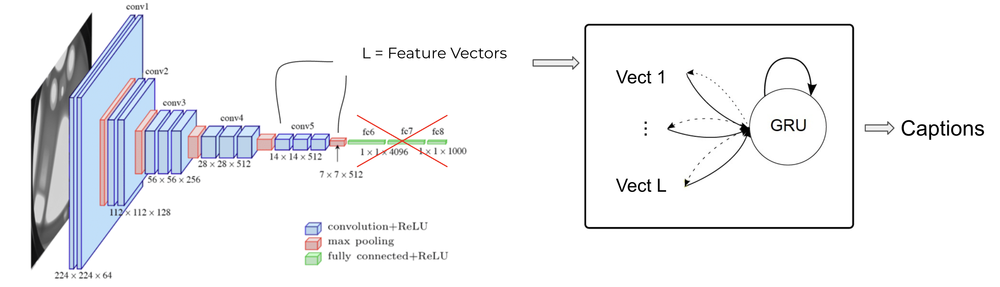
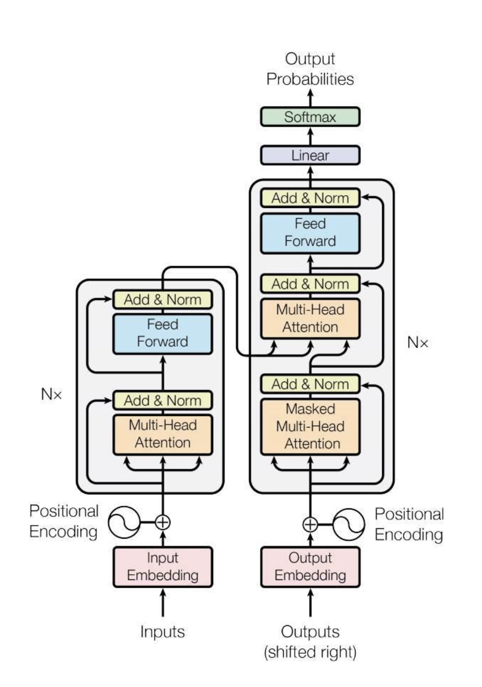
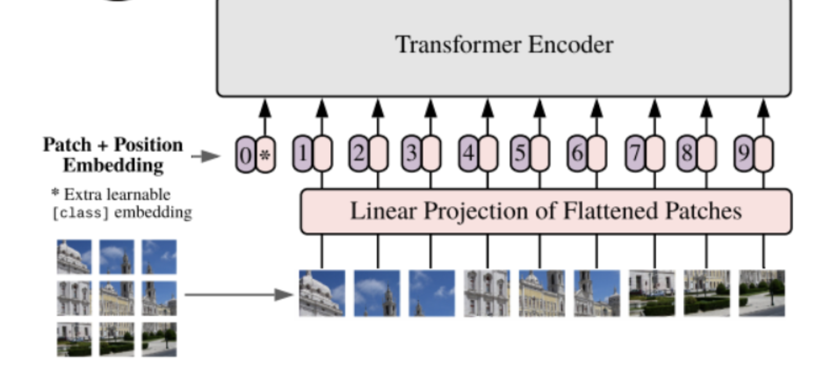

# **Image Captioning - UPC AI w/ DL 2021**

## **Table of contents**
- [**Image Captioning - UPC AI w/ DL 2021**](#image-captioning---upc-ai-w-dl-2021)
	- [**Table of contents**](#table-of-contents)
	- [**Description**](#description)
	- [**Installation**](#installation)
		- [**Create the virtual environment**](#create-the-virtual-environment)
		- [**Install the dependencies**](#install-the-dependencies)
		- [**Train the model**](#train-the-model)
		- [**Download the dataset (optional)**](#download-the-dataset-optional)
	- [**Experiments**](#experiments)
		- [**Attention model**](#attention-model)
			- [**Architecture**](#architecture)
			- [**Results**](#results)
		- [**Transformer model in the decoder**](#transformer-model-in-the-decoder)
			- [**Architecture**](#architecture-1)
			- [**Results**](#results-1)
		- [**Visual Transformers for the encoder**](#visual-transformers-for-the-encoder)
			- [**Architecture**](#architecture-2)
			- [**Results**](#results-2)
	- [**Authors**](#authors)
## **Description**
The following project shows an image captioning system that uses state-of-the-art architectures in DL and AI such as Transformers and Visual Transformers.

The goal of the project is to generate an accurate description given an input image, for that, we need to extract the features of the image and get the generated text as a result, so we need to combine both computer vision and natural language processing.

## **Installation**

### **Create the virtual environment**
```
python3 -m venv .env
source .env/bin/activate
```
### **Install the dependencies**
```
pip install --no-cache-dir -r requirements.txt
```

### **Train the model**
If you want to train your own model you need to execute the `main.py` module: 
```
python main.py
```
Additionally, you can specify these parameters:

```bash
  -h, --help            show this help message and exit
  -bsz {4,8,16,32,64}, --batch-size {4,8,16,32,64}
                        Number of images to process on each batch
  -vocab VOCABULARY_SIZE, --vocabulary-size VOCABULARY_SIZE
                        Number of words that our model will use to generate the captions of the images
  -image-feature {256,512,1024}, --image-features-dimension {256,512,1024}
                        Number of that we will get for each image out of the encoder
  -attn-dim {256,512,1024}, --attention-dimension {256,512,1024}
                        Dimension of the attention tensor
  -embed-dim {256,512,1024}, --embedding-dimension {256,512,1024}
                        Dimension of the word embedding tensor
  -epochs EPOCHS, --epochs EPOCHS
                        Number of epochs that our model will run
  -captions-length CAPTIONS_MAX_LENGTH, --captions-max-length CAPTIONS_MAX_LENGTH
                        Max size of the predicted captions
  -lr {0.1,0.01,0.001,0.0001}, --learning-rate {0.1,0.01,0.001,0.0001}
                        Max size of the predicted captions
  -img-size {224,256,320}, --image-size {224,256,320}
                        Size of the input image that our model will process
  -log LOG_INTERVAL, --log-interval LOG_INTERVAL
                        During training, every X epochs, we log the results
```

### **Download the dataset (optional)**

The dataset used during the training phase is the [Flickr8k](https://www.kaggle.com/adityajn105/flickr8k/).
It consists of 8,000 images that are each paired with five different captions which provide clear descriptions of the salient entities and events. The images were chosen from six different Flickr groups, and tend not to contain any well-known people or locations, but were manually selected to depict a variety of scenes and situations.

The dataset is automatically downloaded by the main.py script when you train the model, but if you want to download it by yourself, you can execute the next script:

```bash
python dataset/download.py
```

## **Experiments**
### **Attention model**
This is our baseline model, we used a CNN as the encoder part, in order to get the features of the image. We then used a RNN network for the decoder and we had an Attention layer in between so we focus on specific parts of the image on each timestep.
#### **Architecture**


#### **Results**

### **Transformer model in the decoder**
Our next step was to introduce the Transformers architecture within our model. We started with the PyTorch implementation of the Transformer decoder.

The main advantage of using this type of network is that we get rid of the recursive steps we previously had with recurrent neural networks.
#### **Architecture**

#### **Results**

### **Visual Transformers for the encoder**
Our final step was to introduce the Visual Transformer inside our model, but this time we wanted it to be our encoder, so we get the features of the images from it. Till this point we were using a pretrained convolutional neural network.
#### **Architecture**

#### **Results**

## **Authors**
* Adriá Molero
* Lucas Werner
* Pere Pujol
* Rai Gordejuela