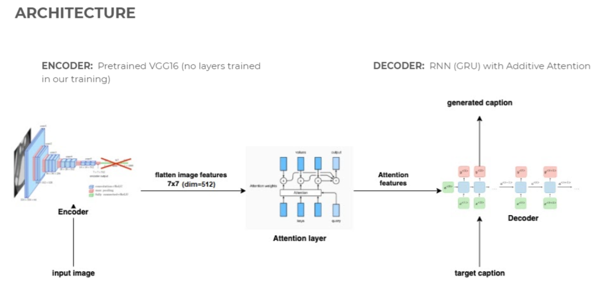
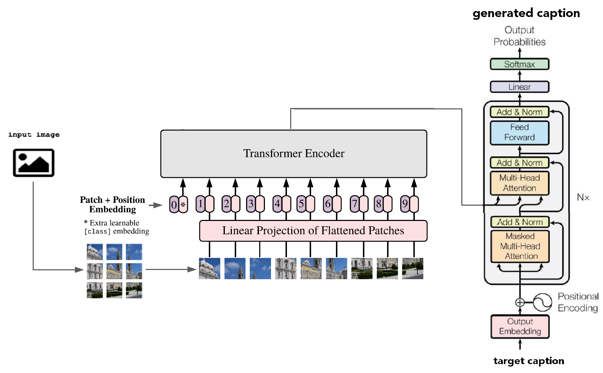

# **Image Captioning - UPC AI w/ DL 2021**

## **Table of contents**
---
- [**Image Captioning - UPC AI w/ DL 2021**](#image-captioning---upc-ai-w-dl-2021)
  - [## **Table of contents**](#-table-of-contents)
  - [## **Description**](#-description)
  - [## **Installation**](#-installation)
    - [**Create the virtual environment**](#create-the-virtual-environment)
    - [**Install the dependencies**](#install-the-dependencies)
    - [**Train the model**](#train-the-model)
    - [**Download the dataset (optional)**](#download-the-dataset-optional)
  - [## **Preprocessing the data**](#-preprocessing-the-data)
  - [## **Model experimentation**](#-model-experimentation)
    - [**Recurrent network with attention**](#recurrent-network-with-attention)
      - [**Architecture**](#architecture)
      - [**Results**](#results)
    - [**Transformer decoder**](#transformer-decoder)
      - [**Architecture**](#architecture-1)
      - [**Results**](#results-1)
    - [**Visual Transformers for the encoder**](#visual-transformers-for-the-encoder)
      - [**Architecture**](#architecture-2)
      - [**Results**](#results-2)
  - [## **Conclusions**](#-conclusions)
  - [## **Future work**](#-future-work)
  - [## **Authors**](#-authors)
## **Description**
---
The following project shows an image captioning system that uses state-of-the-art architectures in DL and AI such as Transformers and Visual Transformers.

The goal of the project is to generate an accurate description given an input image, for that, we need to extract the features of the image and get the generated text as a result, so we need to combine both computer vision and natural language processing.

## **Installation**
---
### **Create the virtual environment**
```
python3 -m venv .env
source .env/bin/activate
```
### **Install the dependencies**
```
pip install --no-cache-dir -r requirements.txt
```

### **Train the model**
If you want to train your own model you need to execute the `main.py` module: 
```
python main.py
```
Additionally, you can specify these parameters:

```bash
  -h, --help            show this help message and exit
  -bsz {4,8,16,32,64}, --batch-size {4,8,16,32,64}
                        Number of images to process on each batch
  -vocab VOCABULARY_SIZE, --vocabulary-size VOCABULARY_SIZE
                        Number of words that our model will use to generate the captions of the images
  -image-feature {256,512,1024}, --image-features-dimension {256,512,1024}
                        Number of that we will get for each image out of the encoder
  -attn-dim {256,512,1024}, --attention-dimension {256,512,1024}
                        Dimension of the attention tensor
  -embed-dim {256,512,1024}, --embedding-dimension {256,512,1024}
                        Dimension of the word embedding tensor
  -epochs EPOCHS, --epochs EPOCHS
                        Number of epochs that our model will run
  -captions-length CAPTIONS_MAX_LENGTH, --captions-max-length CAPTIONS_MAX_LENGTH
                        Max size of the predicted captions
  -lr {0.1,0.01,0.001,0.0001}, --learning-rate {0.1,0.01,0.001,0.0001}
                        Max size of the predicted captions
  -img-size {224,256,320}, --image-size {224,256,320}
                        Size of the input image that our model will process
  -log LOG_INTERVAL, --log-interval LOG_INTERVAL
                        During training, every X epochs, we log the results
```

### **Download the dataset (optional)**

The dataset used during the training phase is the [Flickr8k](https://www.kaggle.com/adityajn105/flickr8k/).
It consists of 8,000 images that are each paired with five different captions which provide clear descriptions of the salient entities and events. The images were chosen from six different Flickr groups, and tend not to contain any well-known people or locations, but were manually selected to depict a variety of scenes and situations.

The dataset is automatically downloaded by the main.py script when you train the model, but if you want to download it by yourself, you can execute the next script:

```bash
python dataset/download.py
```

## **Preprocessing the data**
---
As part of our initial work, we had to process the captions and the images of the dataset. That lead us to create our own `Dataset` class, in which we move from the image folder and the captions given by the CSV file to a ready-to-use pair of image/text.

For the images, similar to what we did in the CNN labs we normalized them using the mean and standard deviation used in ImageNet, since our CNNs have been trained in that dataset.

For the captions, we had to tokenize the input. In order to do that we use the `nltk` package

## **Model experimentation**
---
### **Recurrent network with attention**
#### **Architecture**
This is our baseline model, we first started using a CNN as the image encoder in order to get the features. We used a CNN pretrained on ImageNet, to be more specific, we played around with VGG16 and Resnet50. Similar to what we did in the CNN lab, we froze the convolutional layers of the network and removed the head, so we extract the high level features of the image.

For the decoder part of the network, we used a RNN network and we had an Attention layer in between the encoder and the decoder so we were able to focus on specific parts of the image on each timestep, and that also allowed to us to visualize the attention as you can see in the Results chapter.


#### **Results**
The results of this first model are pretty decent, as you can see, but it could be highly improved in terms of language understanding. This is why we wanted to improve the decoder part first, which lead us to our next architecture.


### **Transformer decoder**
#### **Architecture**
Our next step was to introduce the Transformers architecture within our model. We started with the PyTorch implementation of the Transformer decoder.

The main advantage of using this type of network is that we get rid of the recursive steps we previously had with recurrent neural networks.

Also, as we seen in our previous model that was based in Attention, it lacks language understanding, this could be solved by adding a multi head attention such as the one that's built-in inside the TransformerDecoder layer.

In order to train the model we used the next hyperparameters:

| Learning rate | Image filters | Batch size | Embedding size | Decoder attn. heads | Decoder layers
| ---- | ---- | ---- | ---- | --- | --- |
| 1e-4 | 512 | 64 | 256 | 4 | 1


#### **Results**

### **Visual Transformers for the encoder**
#### **Architecture**
Motivated by the good performance that has been obtained on Image classification with the very recent Visual Transformers, in the last step of this project an architecture based on Visual Transformers is assessed. We use this arquitecture to extract features from our images that are then input to the Transformer based decoders that we used in the previous section so removing the the CNN that we have been using till this point.
As Visual Transformers have proved their competitiveness versus state-of-the-art arquitectures when a large dataset like the Imagenet is used for training, we decided to take advantage of the pre-trained arquitectures that can be downloaded from the Hugging Face website.

For our experiments we used a ViT model pretrained on Imagenet-21K (14 million images, 21.843 classes) at resolution 224x224. This architecture was introduced in the paper [An Image is Worth 16x16 Words: Transformers for Image Recognition at Scale](https://arxiv.org/abs/2010.11929) by Dosovitskiy et al. 

This model gets as imput a number of vectors obtained from the images. These vectors are linear mappings of different patches of the image (16x16 pixels in this case), that have been flattened and positionally encoded.

Input images are first resized to 224x224 size and normalized with mean (0.5, 0.5, 0.5) and standard deviation (0.5, 0.5, 0.5), as this is the preprocessing that was used in pre-training of the model. So, we obtain from the image 14x14 patches of 16x16 pixels each.

The output of the model are the same number of vectors that have passed through 12 self-attention transformer layers. We use these 196 output vectors (14x14) , that are a representation of the images along with the output of the classification token that is usually used in this pre-trained arquitectures is input to our decoder as it can be seen as a representation of an entire image.


#### **Results**


## **Conclusions**
---

## **Future work**
---
* Subwords
* 
## **Authors**
---
* Adriá Molero
* Lucas Werner
* Pere Pujol
* Rai Gordejuela